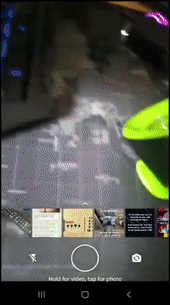

<h1 align="center">
  <a href="https://andresotelo.github.io/the_escape_room/index.html">
    
  </a>
</h1>

<div align="center">
<h1>THE ESCAPE ROOM</h1>
</div>

<div align="center">
  Text-based gaming and learning through machine learning.
</div>

<br>

<div align="center">

</div>

## Getting Started

### Requirements

To run The Escape Room on development mode on your local machine, you must:

1. Create a GCP account: https://cloud.google.com/apigee/docs/hybrid/v1.1/precog-gcpaccount
    * Get your Goole Project ID
2. Create a GCP project: https://cloud.google.com/apigee/docs/hybrid/v1.1/precog-gcpproject
3. Enable billing for the GCP project: https://cloud.google.com/billing/docs/how-to/modify-project#enable_billing_for_an_existing_project
4. Enable APIs for the GCP project: https://cloud.google.com/apigee/docs/hybrid/v1.1/precog-enableapi
   * Cloud Functions for Firebase
   * Cloud Vision API
   * Cloud Translation API
   * Cloud Natural Language API
   * Dialogflow API
5. Create a Dialogflow ES project: https://cloud.google.com/dialogflow/es/docs/quick/setup
    * Set Language: Spanish - es
    * Import agent EscapeRoomBot.zip: https://cloud.google.com/dialogflow/es/docs/agents-settings
6. Install Node.js and npm: https://docs.npmjs.com/downloading-and-installing-node-js-and-npm
7. Install npm packages an client libraries
```bash
$ npm install --save firebase
$ npm install --save @google-cloud/vision
$ npm install --save @google-cloud/translate
$ npm install --save @google-cloud/language
```

## Running the project

1. Set your GCP authentication: https://cloud.google.com/docs/authentication/getting-started
2. Clone the repository and execute backend:
```bash
$ git clone https://github.com/Jong9106/AtomChat-The_escape_room
$ cd AtomChat-The_escape_room/
```


## Deployment

To deploy and use in Telegram 

## Tech Stack

- [Node.js](https://nodejs.org/) - Backend environment execution.
- [Express](https://expressjs.com/) - Backend framework.
- [Firebase](https://firebase.google.com/) - Mobile application development platform.
- [Firestore](https://firebase.google.com/docs/firestore) - Database.
- [Dialogflow ES ](https://cloud.google.com/dialogflow) - Conversational user interface development framework.
- [Vision AI](https://cloud.google.com/vision) - Vision detection features within applications.
- [Translation](https://cloud.google.com/translate) - Multilingual neural machine translation service.
- [Cloud Functions](https://cloud.google.com/functions) - Event-driven serverless compute platform.
- [Google Cloud Platform](https://cloud.google.com/) - Serverless cloud platform.

## License

This project is licensed under the [MIT](https://choosealicense.com/licenses/mit/) License.

## Authors

- **Leonardo Valencia** - *Software Developer - Backend* - [Linkedin](https://www.linkedin.com/in/leovalsan/) - [Github](https://github.com/4ions)
- **Juan Carlos Hernández** - *Software Developer - DevOps* - [Linkedin](https://www.linkedin.com/in/jonghernandez/) - [Github](https://github.com/Jong9106)
- **Andrés Sotelo** - *Software Developer - Frontend* - [Linkedin](https://www.linkedin.com/in/andresotelo/) - [Github](https://github.com/ANDRESOTELO)
- **Rolando Quiroz** - *Machine Learning Engineer - Backend* - [Linkedin](https://www.linkedin.com/in/rolandoquiroz/) - [Github](https://github.com/rolandoquiroz)


## Acknowledgements

- Atom Chat: [](https://atomchat.io/en/home/)

- Holberton School staff and students
